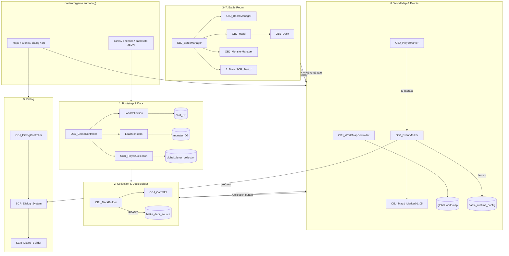
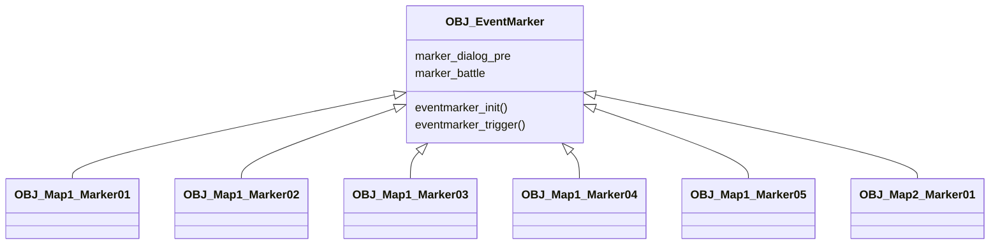
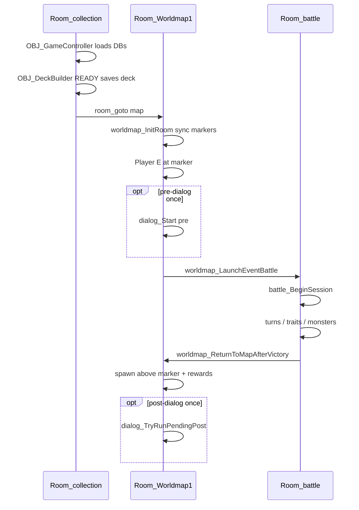

# Full Project Architecture

## Master UML — all systems

## Object hierarchy (inheritance)

## Room & instance flow

## Global state map

| Global | Owner system | Purpose |
|--------|--------------|---------|
| `card_DB` | Bootstrap | All card definitions |
| `monster_DB` | Bootstrap | All enemy definitions |
| `global.player_collection` | Collection | Owned cards |
| `global.battle_deck_source` | Deck builder | Main deck IDs for battle |
| `global.battle_extra_deck_source` | Deck builder | Spirit extra deck |
| `global.worldmap` | World map | Cleared events, rewards, spawn |
| `global.battle_runtime_config` | World map → Battle | Active battle wave config |
| `global.dialog` | Dialog | Active dialog runtime |
| `global.battleset_cache` | Bootstrap | Parsed battleset JSON cache |

## Battle room creation order

Critical order in `Room_battle`:

1. `OBJ_GameController`
2. `OBJ_Deck`
3. `OBJ_Hand`
4. `OBJ_BoardManager`
5. `OBJ_BattleManager`
6. `OBJ_MonsterManager`

## Engine vs content summary

Everything under `scripts/`, `objects/`, and shared `sprites/` placeholders = **tools**.

Per-level dialog, marker configs, map art, battlesets, reward tables = **content** (target: `content/` folder).

See [CONTENT_PIPELINE.md](CONTENT_PIPELINE.md) and per-system guides in [guides/](guides/).
