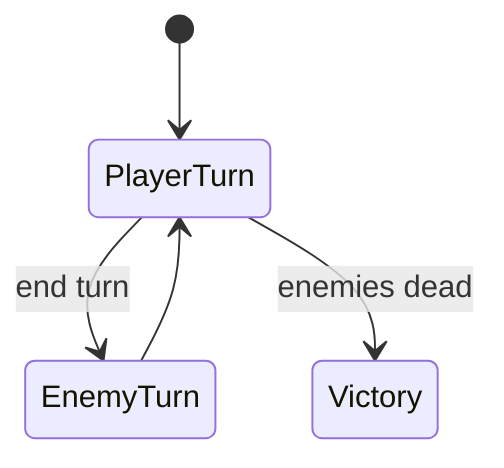

# How to Use — Battle Manager

## Purpose

Orchestrate player/enemy turns, card plays, combat resolution, and victory handling.

## Main scripts

- `SCR_Battle_Init` — room setup entry
- `SCR_Battle_Step` — per-frame logic + victory step hook
- `SCR_Battle_Turn`, `SCR_Battle_PlayCard`, `SCR_Battle_Attack`
- `SCR_Battle_EnemyTurn`, `SCR_Battle_Targeting`
- `SCR_Battle_UI`, `SCR_Battle_Draw`

## Main objects

- `OBJ_BattleManager`

## Responsibilities

- Turn state (`player` / `enemy` / targeting)
- Resource counters and card costs
- Dispatch traits on card play
- Call `worldmap_NotifyBattleVictory` on win

## Dependencies

| System | Link |
|--------|------|
| Board | Slot play targets |
| Hand/Deck | Card source |
| Monster | Enemy queue + enemy turn |
| Traits | Effect execution |
| World map | `global.battle_runtime_config` |

## Public API

```gml
battle_BeginSession();     // Room_battle creation code
SCR_Battle_Init();         // OBJ_BattleManager Create
SCR_Battle_Step();         // OBJ_BattleManager Step
battle_EndSession();       // Cleanup on map return
```

## Initialization order

**Room_battle instance order (required):**
1. OBJ_GameController
2. OBJ_Deck
3. OBJ_Hand
4. OBJ_BoardManager
5. OBJ_BattleManager
6. OBJ_MonsterManager

## Runtime flow



## Example usage

World map launches battle:
```gml
global.battle_runtime_config = battle_GetBattlesetBattle(battleset, "battle01");
room_goto(Room_battle);
```

## Common pitfalls

- Wrong creation order → null hand/deck references
- Fallback `Battle01.json` used if `battle_runtime_config` missing

## Future expansion

- Multi-phase boss fights in one session
- Replay/skip enemy turn animations

## Parent / child

`OBJ_BattleManager` — no parent object.
